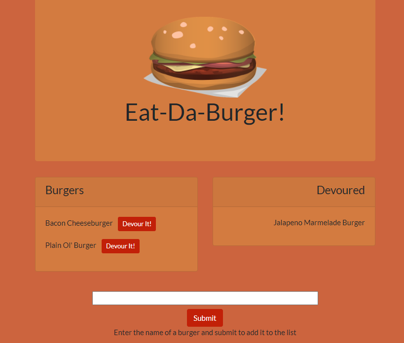

# burger-logger
[](https://opensource.org/licenses/ISC)
## Description
A web application that tracks types of burgers and whether or not they have been devoured. Burgers can be added to the list on the left and then devoured as desired.

Makes use of node.js, Express, Handlebars, and MySQL.

## Table of Contents
* [Installation](#Installation)
* [Usage](#Usage)
* [Screenshot](#Screenshot)
* [Deployment](#Deployment)
* [License](#License)
* [Questions](#Questions)
* [Credits](#Credits)

## Installation
Install the application with
```
npm install
```

The provided [schema.sql](https://github.com/malenchite/burger-logger/blob/main/db/schema.sql) file should be used to structure the required database.

## Usage
A MySQL database must be available, either locally or remotely. Environment variables must be set as follows:
```
DB_HOST = host name of MySQL DB
DB_USER = username for logging in
DB_PWD = password for logging in
DB_NAME = database name
```

The server can then be run with
```
npm start
```

## Screenshot
  

## Deployment
This application has been deployed on Heroku at https://malenchite-burger.herokuapp.com

## License  
This application is covered under the **ISC** license. More info can be found here: [ISC](https://opensource.org/licenses/ISC)

## Questions
Questions about the project? You can contact me at malenchite@gmail.com or check out my GitHub profile at [malenchite](https://github.com/malenchite)

## Credits
#### NPM Packages
* [mysql](https://www.npmjs.com/package/mysql)
* [express](https://www.npmjs.com/package/express)
* [express-handlebars](https://www.npmjs.com/package/express-handlebars)


